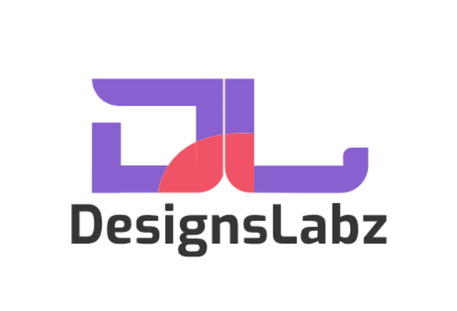

# DesignsLabz WordPress Theme

DesignsLabz is a modern, developer-friendly WordPress theme built for Gutenberg. Featuring clean architecture, SCSS/Webpack integration, and native block support, it offers unmatched flexibility for building custom websites with speed and precision.

---

## 📂 Theme Structure

```
designslabz/
├── assets/                  # All static assets and source files
│   ├── build/               # Compiled CSS/JS assets (output from Webpack)
│   ├── fonts/               # Font files (woff, ttf, etc.)
│   ├── images/              # Image assets (SVG, PNG, etc.)
│   ├── js/                  # JavaScript source files
│   ├── lib/                 # Third-party libraries (e.g., Swiper.js, vendor scripts)
│   └── scss/                # SCSS source files
│
├── includes/                # PHP classes, helper functions, and theme logic
│
├── parts/                   # Reusable template parts (e.g., header, footer sections, loops)
│
├── .gitignore               # Git ignored files and folders
│
├── 404.php                  # 404 error template
│
├── footer.php               # Footer template
│
├── functions.php            # Theme setup, hooks, and main includes
│
├── header.php               # Header template
│
├── index.php                # Main fallback template
│
├── package.json             # Node dependencies and scripts
│
├── page.php                 # Page template
│
├── postcss.config.js        # PostCSS configuration (e.g., autoprefixer)
│
├── README.md                # Theme documentation
│
├── screenshot.png           # Theme preview image for WordPress admin
│
├── style.css                # Theme metadata (required header) and minimal styles
│
├── theme.json               # Global styles and settings for block editor (WordPress 5.8+)
│
├── webpack.config.js        # Webpack configuration for asset bundling
│
└── ...

```

---

## ✨ Features

✅ Fully Responsive Design  
✅ Gutenberg Block Editor Support  
✅ Custom Theme Options Page  
✅ Reusable Blocks Integration (header/footer)  
✅ SCSS Variables and Mixins  
✅ SEO-Friendly Markup    

---

## ⚙️ Installation

1. **Download or Clone:**

   ```
   git clone https://github.com/team-designslabz/designslabz-theme.git
   ```

2. Copy the theme folder into your WordPress `/wp-content/themes/` directory.

3. Log in to WordPress Admin and activate **DesignsLabz** under *Appearance > Themes*.

4. If using build tools (SCSS, JS), install dependencies:

   ```
   npm install
   npm run build
   ```

---

## 🎨 Customization

- **Theme Options:**
  Navigate to *Appearance > Theme Options* to configure:
  - Header Message Bar
  - Header Social Menu
  - Header Menu
  - Footer Reusable Block
  - 404 Page Content
  - Google Tag Manager ID

- **SCSS Variables & Mixins:**
  Adjust core colors and utilities in:

  ```
  /assets/scss/base/_variables.scss
  /assets/scss/base/_mixins.scss
  ```

- **Reusable Blocks:**
  Assign reusable blocks for the header, footer, and other sections.

---

## 🧩 Requirements

- WordPress 6.x+
- PHP 7.4+
- Node.js 18+ (for build tools)

---

## 🛠️ Development

### SCSS & JavaScript Build

1. Install dependencies:

   ```
   npm install
   ```

2. Build assets:

   ```
   npm run build
   ```

3. Watch files during development:

   ```
   npm run watch
   ```

---

## 🙌 Credits

- WordPress Core
- Fluent Forms Plugins

---

## 📄 License

This theme is licensed under the [GNU GPL v2.0 or later](https://www.gnu.org/licenses/old-licenses/gpl-2.0.en.html).

---

## ✨ Screenshot



---

**Happy building with DesignsLabz! 🚀**
